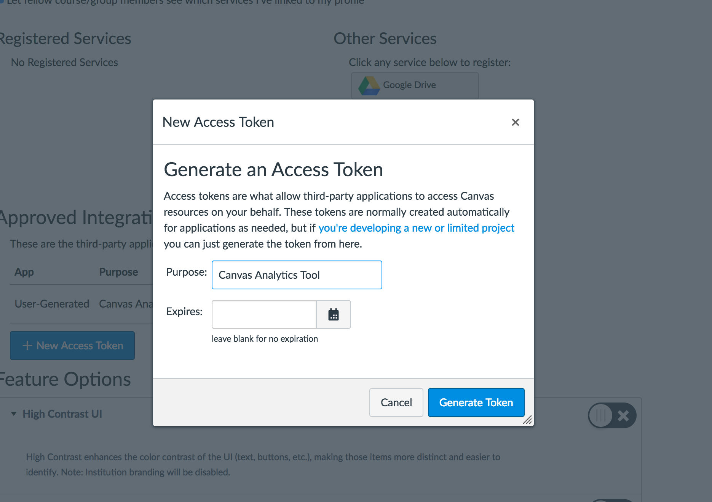

# Canvas LMS Analytics
Generates analytical reports using data from UT Austin's Canvas LMS Instance

## How to Generate Authentication Token
Go to https://yourcanvasinstance.instructure.com/profile/settings

From there, generate a new access token. You should see the following modal:



Fill in the information to your liking.

Next, modify the following line of code with your newly generated authentication token in the canvas_analytics.py script:

```
# authentication token for testing
auth_token = "<Your authentication token>"
```
## Performance Issues
However, this approach is a little slow. A closer examination of the script shows that we make way to many API calls to get information. This can be easily circumvented if we make one API call to download a CSV file containing all the information we are querying for. From here, we can read the information directly from the file in memory.

This is more efficient because getting information from the Canvas servers has a lot of overhead. Grabbing information from memory is much cheaper.